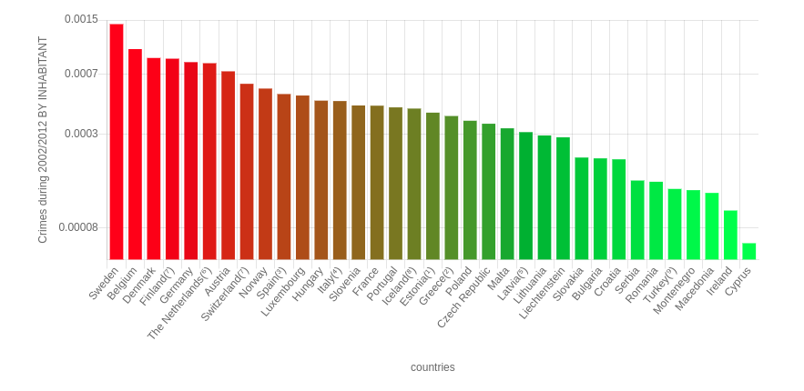

# DATA VISUALISATION PROJECT

Technologies used : 

* javascript
* ChartJs library

* JQuery

  

## My adventure

##### 1st graph

I first tried to take numbers in the table and put them in a bar chart. This is the result : 

At first glance, I found 3 things I wanted to change to have a better chart, more readable. 

* Sort countries from high to low crimes recorded

* Calculate total crimes during the 10 years (make one bar instead on ten) by countries

* Take into account population by countries, without that these numbers mean nothing to me

   

  These 3 points forced me to restart the project. I had to first start by process datas from the table. Sort all countries by a total number of crimes BY inhabitant, then recreate a new object with all these new datas and finally inject this result in a new chart.

  It took me a lot of time, but the result is more satisfying imho.

  This is the result:

  

  

